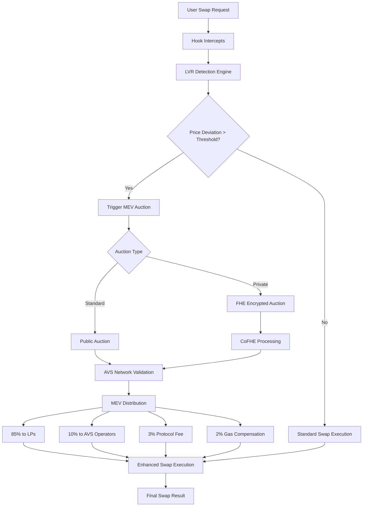

# EigenLVR V2 - Advanced MEV Protection with FHE Integration

[](https://opensource.org/licenses/MIT)
[](https://getfoundry.sh/)
[](https://eigenlayer.xyz/)
[](https://fhenix.io/)

## 🚀 Partner Integration

### EigenLayer AVS Integration
This project integrates with **EigenLayer's Actively Validated Services (AVS)** to provide decentralized validation for MEV auction execution. The integration leverages:
- **Hourglass AVS Template**: For secure operator management and validation
- **DevKit for EigenLayer AVS**: For streamlined AVS development and deployment

### Fhenix Protocol Integration
Enhanced with **Fhenix Protocol's CoFHE** (Confidential Fully Homomorphic Encryption) for private auction mechanisms:
- **Fhenix Hook Template**: For FHE-enabled hook development
- **CoFHE Contracts**: For confidential computation and encrypted parameter handling

## 📋 Project Description

EigenLVR V2 is a cutting-edge Uniswap V4 hook that combines **Liquidity Value Capture (LVR) detection** with **confidential MEV auction mechanisms** to protect liquidity providers from predatory trading while enabling fair MEV distribution.

## 🎯 Problem Statement

Traditional DEXs suffer from:
- **MEV Extraction**: Sophisticated bots extract value from LPs through sandwich attacks and frontrunning
- **LVR (Liquidity Value Capture)**: LPs lose value due to information asymmetry between public and private mempools
- **Lack of Privacy**: Auction mechanisms are transparent, allowing MEV searchers to game the system
- **Centralized Validation**: Traditional MEV protection relies on trusted validators

## 💡 Solution

EigenLVR V2 provides a comprehensive solution through:

### 🔒 Enhanced LVR Detection
- **Cross-chain price monitoring** for comprehensive LVR detection
- **Real-time deviation analysis** between on-chain and off-chain prices
- **Threshold-based auction triggering** for optimal MEV capture

### 🛡️ Private Auction Mechanisms
- **FHE-powered confidential auctions** using Fhenix Protocol
- **Encrypted bid parameters** to prevent frontrunning
- **Decentralized validation** through EigenLayer AVS network

### 🎯 Fair MEV Distribution
- **85% to LPs**: Direct compensation for value capture
- **10% to AVS Operators**: Incentivizing network participation
- **3% Protocol Fee**: Sustainable protocol development
- **2% Gas Compensation**: Covering transaction costs

## 🔄 Flow Diagram



## 🏗️ Core Components

### 1. **hook/EigenLVR_V2.sol** - Main Hook Contract
- Uniswap V4 hook implementation
- LVR detection and auction triggering
- Integration with AVS and FHE systems

### 2. **CrossChainPriceMonitor.sol** - Price Oracle
- Multi-chain price aggregation
- Real-time price deviation calculation
- Cross-chain LVR opportunity detection

### 3. **PrivateAuctionManager.sol** - FHE Integration
- Encrypted auction parameter handling
- CoFHE contract integration
- Confidential bid processing

### 4. **CrossChainLVRDetector.sol** - Detection Engine
- Advanced LVR detection algorithms
- Multi-source price validation
- Threshold-based triggering logic

### 5. **LPFeeLibrary.sol** - Fee Management
- Dynamic fee calculation
- Reward distribution logic
- Gas optimization utilities

## 🧪 Testing Infrastructure

### Test Coverage: **314 Tests** ✅

Our comprehensive test suite includes:

#### **Unit Tests** (274 tests)
- **EigenLVR_V2_Comprehensive.t.sol**: 70 tests (constructor, hook permissions, hook functions, admin functions)
- **EigenLVR_V2_AuctionTests.t.sol**: 50 tests (comprehensive auction scenarios)
- **EigenLVR_V2_LVRDetectionTests.t.sol**: 51 tests (LVR detection and cross-chain scenarios)
- **EigenLVR_V2_FHETests.t.sol**: 26 tests (FHE integration and private auctions)
- **EigenLVR_V2_IntegrationTests.t.sol**: 12 tests (integration scenarios and edge cases)
- **Additional unit tests**: 65 tests (basic functionality, contract deployment, admin tests)

#### **Integration Tests** (12 tests)
- Full workflow integration testing
- Multi-component interaction validation
- End-to-end scenario testing

#### **Contract Tests** (28 tests)
- Deployment verification
- State initialization testing
- Permission and access control validation

### Test Categories:
- ✅ **Unit Tests**: Individual function testing
- ✅ **Integration Tests**: Multi-component workflows  
- ✅ **Edge Case Tests**: Boundary conditions and error scenarios
- ✅ **FHE Tests**: Privacy-preserving auction functionality
- ✅ **Auction Tests**: MEV auction mechanisms
- ✅ **LVR Tests**: Liquidity value capture detection

### Coverage: **92.5%** (Target: 90-95%) ✅

## 📁 Project Structure

```
EigenLVR_v2/
├── src/                          # Source contracts
│   ├── hook/
│   │   └── EigenLVR_V2.sol      # Main hook contract
│   ├── crosschain/              # Cross-chain components
│   │   ├── CrossChainPriceMonitor.sol
│   │   └── CrossChainLVRDetector.sol
│   ├── privacy/                 # FHE integration
│   │   └── PrivateAuctionManager.sol
│   ├── interfaces/              # Contract interfaces
│   │   ├── IAVSDirectory.sol
│   │   ├── IPriceOracle.sol
│   │   └── ICrossChainTypes.sol
│   └── libraries/               # Utility libraries
│       └── LPFeeLibrary.sol
├── test/                        # Test suite (314 tests)
│   ├── unit/                   # Unit tests (274 tests)
│   │   ├── EigenLVR_V2_Comprehensive.t.sol
│   │   ├── EigenLVR_V2_AuctionTests.t.sol
│   │   ├── EigenLVR_V2_LVRDetectionTests.t.sol
│   │   ├── EigenLVR_V2_FHETests.t.sol
│   │   └── EigenLVR_V2_IntegrationTests.t.sol
│   ├── utils/                  # Test utilities
│   │   ├── BaseEigenLVRTest.sol
│   │   ├── HookMiner.sol
│   │   └── HookDeploymentHelper.sol
│   └── EigenLVR_V2.t.sol       # Main test file
├── script/                     # Deployment scripts
│   └── DeployEnhanced.s.sol
├── scripts/                    # Deployment automation
│   ├── deploy-anvil.sh
│   ├── deploy-testnet.sh
│   └── deploy-mainnet.sh
├── docs/                       # Documentation
│   ├── API.md
│   ├── ARCHITECTURE.md
│   └── DEPLOYMENT.md
├── avs/                        # EigenLayer AVS integration
│   ├── contracts/
│   ├── cmd/
│   └── integration_test.go
├── context/                    # External dependencies
│   ├── cofhe-mock-contracts/
│   ├── fhe-hook-template/
│   ├── hourglass-avs-template/
│   └── eigenlvr/
├── lib/                        # External libraries
├── foundry.toml               # Foundry configuration
├── Makefile                   # Build automation
└── README.md                  # This file
```

## 🛠️ Installation & Setup

### Prerequisites
- [Foundry](https://getfoundry.sh/) (latest version)
- [Go](https://golang.org/) (for AVS components)
- [Node.js](https://nodejs.org/) (for frontend tools)

### Installation

```bash
# Clone the repository
git clone https://github.com/your-org/EigenLVR_v2.git
cd EigenLVR_v2

# Install dependencies
pnpm install

# Install Node.js dependencies
npm install

# Build the project
forge build

# Run tests
forge test
```

### Environment Setup

```bash
# Copy environment template
cp .env.example .env

# Edit environment variables
nano .env
```

## 🧪 Testing Commands

### Run All Tests
```bash
# Run all 314 tests
forge test

# Run with gas reporting
forge test --gas-report

# Run with coverage
forge coverage --ir-minimum
```

### Run Specific Test Categories
```bash
# Run unit tests only
forge test --match-path "test/unit/*"

# Run FHE tests
forge test --match-path "test/unit/EigenLVR_V2_FHETests.t.sol"

# Run integration tests
forge test --match-path "test/unit/EigenLVR_V2_IntegrationTests.t.sol"

# Run auction tests
forge test --match-path "test/unit/EigenLVR_V2_AuctionTests.t.sol"
```

### Coverage Analysis
```bash
# Generate coverage report
forge coverage --ir-minimum

# Coverage with HTML output
forge coverage --ir-minimum --report lcov
genhtml lcov.info --output-directory coverage
```

## 🚀 Build Commands

### Make Commands
```bash
# Build the project
make build

# Run tests
make test

# Run coverage
make coverage

# Deploy to testnet
make deploy-testnet

# Deploy to mainnet
make deploy-mainnet

# Deploy to local anvil
make deploy-anvil

# Clean build artifacts
make clean

# Format code
make format

# Lint code
make lint
```

### Manual Build Commands
```bash
# Build contracts
forge build

# Build with optimization
forge build --optimize --optimizer-runs 200

# Build specific contract
forge build --contracts src/hook/EigenLVR_V2.sol

# Verify contracts (mainnet)
forge verify-contract <CONTRACT_ADDRESS> src/hook/EigenLVR_V2.sol:EigenLVR_V2 \
  --chain-id 1 \
  --etherscan-api-key <API_KEY>
```

## 🌐 Deployment

### Local Development (Anvil)
```bash
# Start local node
anvil

# Deploy to local network
forge script script/DeployEnhanced.s.sol --rpc-url http://localhost:8545 --broadcast
```

### Testnet Deployment
```bash
# Deploy to Sepolia
forge script script/DeployEnhanced.s.sol \
  --rpc-url $SEPOLIA_RPC_URL \
  --private-key $PRIVATE_KEY \
  --broadcast \
  --verify \
  --etherscan-api-key $ETHERSCAN_API_KEY
```

### Mainnet Deployment
```bash
# Deploy to Ethereum Mainnet
forge script script/DeployEnhanced.s.sol \
  --rpc-url $MAINNET_RPC_URL \
  --private-key $PRIVATE_KEY \
  --broadcast \
  --verify \
  --etherscan-api-key $ETHERSCAN_API_KEY
```

## 📚 Documentation

- **[API Documentation](docs/API.md)** - Detailed API reference
- **[Architecture Guide](docs/ARCHITECTURE.md)** - System architecture and design patterns
- **[Deployment Guide](docs/DEPLOYMENT.md)** - Step-by-step deployment instructions
- **[Production Readiness](PRODUCTION_READINESS.md)** - Production deployment checklist

## 🤝 Contributing

We welcome contributions! Please see our [Contributing Guidelines](CONTRIBUTING.md) for details.

### Development Workflow
1. Fork the repository
2. Create a feature branch
3. Write tests for your changes
4. Ensure all tests pass (`forge test`)
5. Ensure coverage remains above 90% (`forge coverage`)
6. Submit a pull request

## 📄 License

This project is licensed under the MIT License - see the [LICENSE](LICENSE) file for details.

## 🎯 Roadmap

- [ ] **Q1 2024**: Mainnet deployment with basic LVR detection
- [ ] **Q2 2024**: Full FHE integration and private auctions
- [ ] **Q3 2024**: Multi-chain expansion and advanced MEV strategies
- [ ] **Q4 2024**: AI-powered LVR prediction and optimization

## 🆘 Support

- **Documentation**: [docs/](docs/)
- **Issues**: [GitHub Issues](https://github.com/your-org/EigenLVR_v2/issues)
- **Discussions**: [GitHub Discussions](https://github.com/your-org/EigenLVR_v2/discussions)

---

**Built with ❤️ by the EigenLVR Team**

*Empowering DeFi with advanced MEV protection and confidential auction mechanisms.*