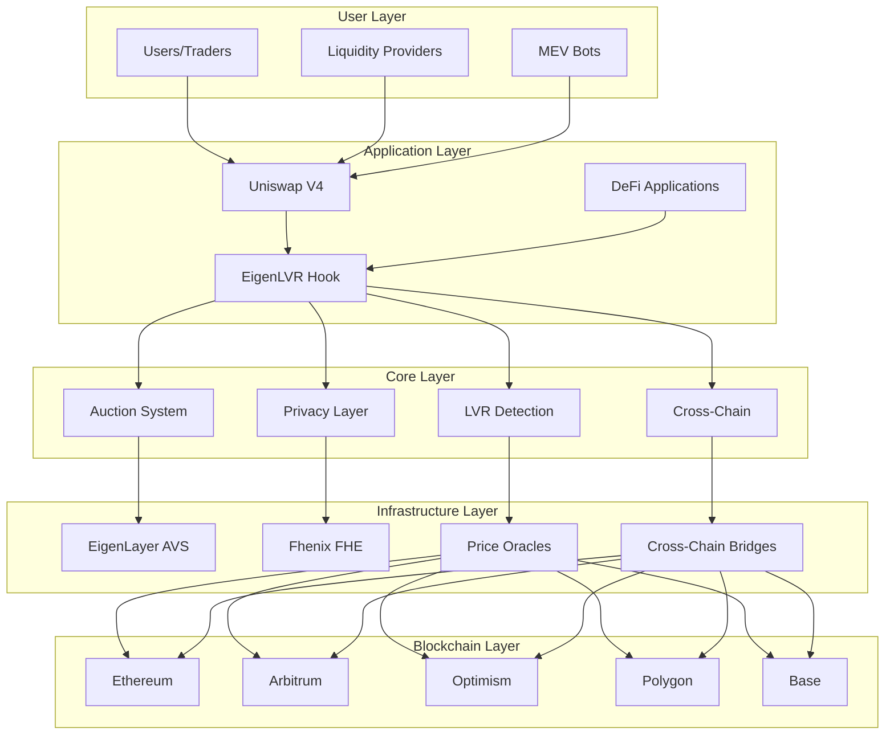
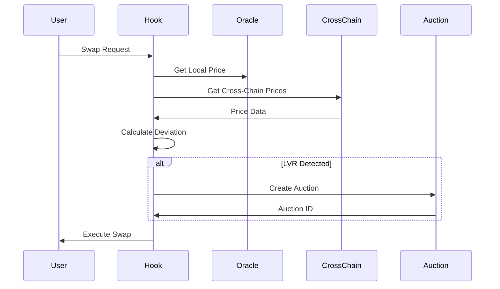
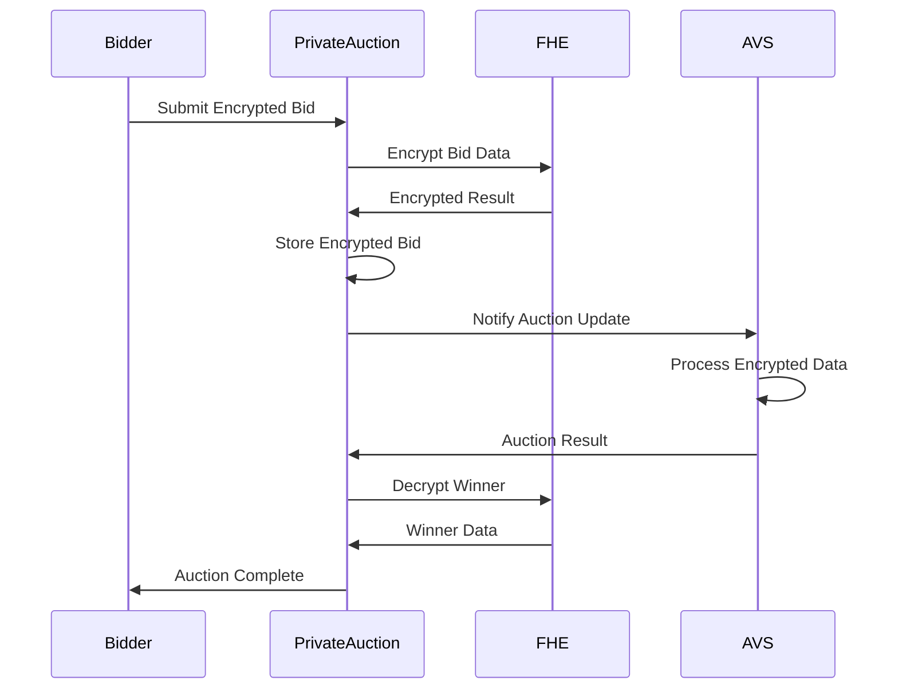
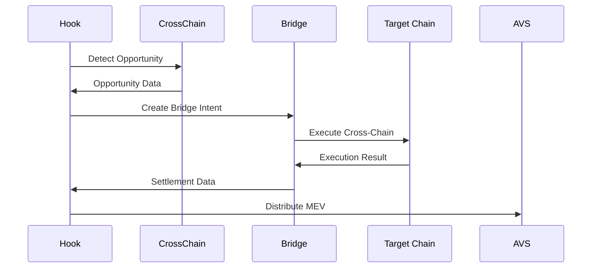

# EigenLVR v2 Architecture Documentation

## Overview

EigenLVR v2 is a comprehensive MEV protection system that extends the proven success of EigenLVR from single-chain to universal cross-chain MEV protection. The architecture combines three key layers:

1. **Cross-Chain LVR Arbitrage**: Multi-chain price monitoring and arbitrage opportunity identification
2. **Private Auction Mechanisms**: FHE-powered sealed bidding with zero information leakage
3. **EigenLayer AVS Security**: Decentralized validation network for secure execution

## System Architecture

### High-Level Architecture



## Core Components

### 1. EigenLVR Hook (`EigenLVR_V2.sol`)

The main Uniswap V4 hook that implements the core MEV protection logic.

#### Key Functions:
- `beforeSwap()`: Detects LVR opportunities and triggers auctions
- `afterSwap()`: Processes completed swaps and distributes MEV
- `beforeAddLiquidity()`: Tracks liquidity provider positions
- `beforeRemoveLiquidity()`: Updates liquidity tracking on removal

#### State Variables:
```solidity
mapping(PoolId => bytes32) public activeAuctions;
mapping(PoolId => mapping(address => uint256)) public lpLiquidity;
mapping(PoolId => uint256) public totalLiquidity;
mapping(bytes32 => AuctionLib.Auction) public auctions;
```

### 2. Cross-Chain Components

#### CrossChainPriceMonitor.sol
Monitors price feeds across multiple chains and identifies arbitrage opportunities.

```solidity
struct PriceData {
    uint256 price;
    uint256 timestamp;
    uint256 confidence;
    bool isValid;
}

mapping(uint256 => mapping(bytes32 => PriceData)) public chainPrices;
mapping(uint256 => address) public chainOracles;
```

#### CrossChainLVRDetector.sol
Detects cross-chain LVR opportunities by comparing prices across chains.

```solidity
struct CrossChainOpportunity {
    uint256 sourceChain;
    uint256 targetChain;
    uint256 profitBps;
    uint256 volume;
    bool isActive;
    uint256 deadline;
}
```

### 3. Privacy Components

#### PrivateAuctionManager.sol
Manages FHE-powered private auctions with complete information protection.

```solidity
struct PrivateAuction {
    bytes32 auctionId;
    euint64 encryptedMinBid;
    euint64 encryptedReserve;
    euint64 encryptedWinningBid;
    eaddress encryptedWinner;
    bool isActive;
    uint256 deadline;
}
```

### 4. Libraries

#### AuctionLib.sol
Contains auction management logic and MEV distribution calculations.

```solidity
struct Auction {
    PoolId poolId;
    uint256 startTime;
    uint256 duration;
    uint256 minBid;
    uint256 reservePrice;
    uint256 highestBid;
    address highestBidder;
    bool isComplete;
    bool isPrivate;
}
```

#### LPFeeLibrary.sol
Calculates liquidity provider fee distributions based on their contribution.

## Data Flow

### 1. LVR Detection Flow



### 2. Private Auction Flow



### 3. Cross-Chain Execution Flow



## Security Model

### 1. EigenLayer AVS Security

- **Decentralized Validation**: Multiple independent operators validate auction results
- **Slashing Conditions**: Operators are slashed for malicious behavior
- **Economic Security**: Stake-based security model with economic incentives

### 2. FHE Privacy Guarantees

- **Zero Information Leakage**: All auction data remains encrypted during processing
- **Selective Decryption**: Only necessary information is revealed
- **Cryptographic Security**: Based on proven FHE schemes

### 3. Cross-Chain Security

- **Bridge Security**: Leverages battle-tested cross-chain bridges
- **Settlement Guarantees**: Atomic execution across chains
- **Fallback Mechanisms**: Graceful degradation on bridge failures

## Performance Considerations

### 1. Gas Optimization

- **Via-IR Compilation**: Maximum optimization for gas efficiency
- **Storage Optimization**: Efficient storage patterns and packing
- **Function Optimization**: Minimal external calls and computations

### 2. Cross-Chain Latency

- **Parallel Processing**: Simultaneous monitoring of multiple chains
- **Caching**: Price data caching to reduce oracle calls
- **Prediction**: ML-based price prediction for faster execution

### 3. FHE Performance

- **Selective Encryption**: Only critical data is encrypted
- **Batch Processing**: Multiple operations in single FHE call
- **Hardware Acceleration**: Optimized for FHE hardware

## Scalability Design

### 1. Horizontal Scaling

- **Multi-Chain Support**: Easy addition of new chains
- **Modular Architecture**: Independent component scaling
- **Load Balancing**: Distributed processing across operators

### 2. Vertical Scaling

- **Gas Optimization**: Efficient contract execution
- **Storage Optimization**: Minimal on-chain storage
- **Computation Optimization**: Efficient algorithms and data structures

## Monitoring and Observability

### 1. Metrics

- **LVR Detection Rate**: Percentage of LVR opportunities detected
- **Auction Success Rate**: Percentage of successful auctions
- **Cross-Chain Execution Rate**: Success rate of cross-chain operations
- **MEV Distribution**: Amount of MEV returned to LPs

### 2. Logging

- **Event Logging**: Comprehensive event emission for all operations
- **Error Tracking**: Detailed error logging and reporting
- **Performance Metrics**: Gas usage and execution time tracking

### 3. Alerting

- **Anomaly Detection**: Unusual patterns in MEV detection
- **System Health**: AVS operator health monitoring
- **Security Alerts**: Suspicious activity detection

## Future Enhancements

### 1. Advanced Features

- **Machine Learning**: AI-powered MEV detection and prediction
- **Dynamic Pricing**: Adaptive auction parameters based on market conditions
- **Cross-Chain DEX**: Native cross-chain DEX integration

### 2. Protocol Integrations

- **Additional DEXs**: Support for other DEX protocols
- **Lending Protocols**: Integration with lending and borrowing protocols
- **Derivatives**: Support for derivatives and options trading

### 3. Privacy Enhancements

- **Zero-Knowledge Proofs**: Additional privacy guarantees
- **Mixer Integration**: Integration with privacy mixers
- **Anonymous Auctions**: Complete anonymity for auction participants
