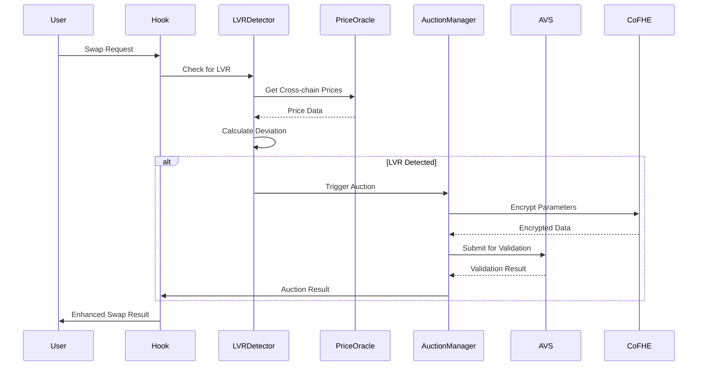

# EigenLVR V2 Architecture Overview

## System Architecture

EigenLVR V2 is built as a modular system that integrates multiple cutting-edge technologies:

### Core Components

1. **Uniswap V4 Hook** - Main entry point for all swap operations
2. **LVR Detection Engine** - Cross-chain price monitoring and deviation analysis
3. **Private Auction Manager** - FHE-powered confidential auction mechanisms
4. **AVS Integration** - EigenLayer validation network integration
5. **Cross-chain Price Monitor** - Multi-chain price aggregation

### Technology Stack

- **Smart Contracts**: Solidity 0.8.26 with Foundry framework
- **FHE Integration**: Fhenix Protocol CoFHE contracts
- **AVS Integration**: EigenLayer Hourglass AVS template
- **Cross-chain**: Custom price monitoring and validation
- **Testing**: Comprehensive test suite with 314 tests

## Data Flow

## Security Model

### Multi-layered Security
1. **Smart Contract Security**: OpenZeppelin libraries, access controls, pausability
2. **FHE Privacy**: Encrypted auction parameters prevent frontrunning
3. **AVS Validation**: Decentralized validation network prevents single points of failure
4. **Cross-chain Verification**: Multiple price sources prevent manipulation

### Access Control
- **Owner**: Contract ownership and critical parameter updates
- **Operators**: Authorized AVS operators for validation
- **Pausable**: Emergency pause functionality for critical issues

## Integration Points

### EigenLayer AVS
- **Hourglass Template**: Provides operator management and validation
- **DevKit Integration**: Streamlined AVS development workflow
- **Stake Management**: Automated stake handling and slashing protection

### Fhenix Protocol
- **CoFHE Contracts**: Confidential computation capabilities
- **Hook Template**: FHE-enabled hook development framework
- **Key Management**: Secure FHE key handling and rotation

### Uniswap V4
- **Hook Interface**: Full compliance with V4 hook standards
- **Pool Manager**: Integration with V4 pool management
- **Fee Handling**: Custom fee distribution mechanisms

## Scalability Considerations

### Gas Optimization
- **Efficient Algorithms**: Optimized LVR detection algorithms
- **Batch Operations**: Batch processing for multiple auctions
- **Storage Optimization**: Minimal state storage requirements

### Cross-chain Scalability
- **Modular Design**: Easy addition of new chains
- **Price Aggregation**: Efficient multi-source price collection
- **Validation Distribution**: Distributed validation across multiple AVS operators

## Monitoring and Observability

### Key Metrics
- **LVR Detection Rate**: Percentage of swaps with detected LVR
- **Auction Success Rate**: Successful auction execution rate
- **Gas Efficiency**: Gas consumption per operation
- **Cross-chain Latency**: Price update and validation latency

### Alerting
- **Critical Issues**: Immediate alerts for system failures
- **Performance Degradation**: Alerts for suboptimal performance
- **Security Events**: Alerts for suspicious activity

## Future Enhancements

### Planned Features
- **AI-powered LVR Prediction**: Machine learning for LVR forecasting
- **Dynamic Fee Adjustment**: Adaptive fee structures based on market conditions
- **Multi-chain Expansion**: Support for additional blockchain networks
- **Advanced MEV Strategies**: Sophisticated MEV capture mechanisms

### Research Areas
- **Zero-knowledge Integration**: ZK-proofs for enhanced privacy
- **Cross-chain Atomic Swaps**: Atomic cross-chain MEV capture
- **Game Theory Optimization**: Advanced auction mechanism design
